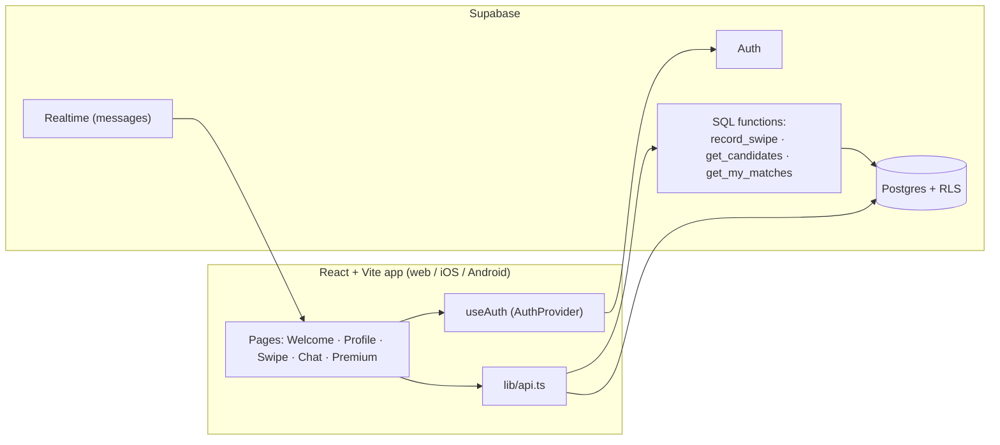

<!-- ══════════════════════════ TITLE ══════════════════════════ -->
<div align="center">
  
</div>

<br/>

<!-- ══════════════════════ IDIOMAS / LANGUAGES ══════════════════════ -->
<div align="center">
<a href="README.md"></a>
<a href="README.en.md"></a>
<a href="README.es.md"></a>
</div>

<br/>

<!-- ══════════════════════════ COVER ══════════════════════════ -->
<div align="center">


<br/>


</div>

<div align="center">

<a href="#about"></a>
<a href="#features"></a>
<a href="#architecture"></a>
<a href="#tech-stack"></a>
<a href="#setup"></a>
<a href="#mobile-build"></a>

</div>

<br/>

> ⚠️ **Closed source.** This repository is public for reference/evaluation only — see [License](#license). No use, copying or distribution is permitted without authorization.

<div align="center">
  
</div>

<!-- ══════════════════════════ ABOUT ══════════════════════════ -->
## About

**gamematch** is a mobile-first dating-style app for gamers. Instead of browsing endless friend lists, you swipe through other players, like the ones you want to play with, and when the interest is mutual you **match** and can start chatting. Profiles are built around what people actually play — favourite games, the game they're playing right now, location and interests — so the people you meet are people you can squad up with.

It's a real full-stack application: a React + TypeScript front-end backed by **Supabase** (Postgres + Auth + Realtime), with all matching logic enforced server-side through SQL functions and Row Level Security. The same web build also ships to **iOS and Android** via Capacitor.

<!-- ══════════════════════════ FEATURES ══════════════════════════ -->
## Features

| Feature | What it does |
|---|---|
| **Email authentication** | Sign up/sign in via Supabase Auth; sessions persist and refresh automatically |
| **Auto-provisioned profiles** | A profile row is created automatically on signup (DB trigger), with a unique username derived from the email |
| **Editable profiles** | Nickname, bio, age, location, avatar emoji, current game, favourite games and interests |
| **Swipe matchmaking** | A card deck of candidates you haven't swiped yet. Like, pass or super-like; a mutual like creates a match |
| **In-deck game filter** | Filter the deck by the games most common in the candidate pool |
| **Matches & chat** | Every match opens a conversation; messages are stored per match, with the latest message shown in the list |
| **Premium screen** | A subscription/upgrade page surfacing premium plans and perks |
| **Protected routes** | Profile, swipe and chat are gated behind authentication |
| **Secure by design** | Row Level Security on every table — swipes, matches and message access are enforced in Postgres, not just the UI |
| **Cross-platform** | Runs in the browser and as a native iOS/Android app via Capacitor |

<!-- ══════════════════════════ ARCHITECTURE ══════════════════════════ -->
## Architecture



How a match happens: a swipe is sent to the `record_swipe` function, which records the like/pass and, if the other player already liked you back, creates a `matches` row and returns `{ matched: true }`. Candidates come from `get_candidates` (everyone except you and the people you've already swiped), and `get_my_matches` returns each match with the other person's profile and last message.

<!-- ══════════════════════════ TECH STACK ══════════════════════════ -->
## Tech Stack

| Layer | Technology |
|---|---|
| Language | TypeScript |
| UI | React 18, Tailwind CSS + `tailwindcss-animate`, shadcn/ui (Radix UI) |
| Build | Vite 5 (`@vitejs/plugin-react-swc`) |
| Routing | React Router |
| Data fetching | TanStack Query |
| Forms | React Hook Form + Zod |
| Backend | Supabase (Postgres, Auth, Realtime) |
| Mobile | Capacitor (iOS / Android) |

<!-- ══════════════════════════ SETUP ══════════════════════════ -->
## Setup

**1. Prerequisites:** Node.js 18+, npm, a free [Supabase](https://supabase.com/) project.

**2. Install:**
```bash
git clone https://github.com/geoggrigori/gamematch.git
cd gamematch
npm install
```

**3. Database:** in the Supabase **SQL Editor**, run `supabase/schema.sql` — creates the `profiles`, `swipes`, `matches`, `messages` tables, the matching SQL functions, RLS policies, the auto-profile trigger, and enables Realtime on `messages`.

**4. Environment variables:**
```bash
cp .env.example .env.local
```
```dotenv
VITE_SUPABASE_URL=https://YOUR-PROJECT-ref.supabase.co
VITE_SUPABASE_ANON_KEY=YOUR-ANON-PUBLIC-KEY
```

**5. Run:**
```bash
npm run dev   # http://localhost:8080
```

<!-- ══════════════════════════ MOBILE BUILD ══════════════════════════ -->
## Mobile Build

The web build is wrapped as a native app via Capacitor (app id `app.gamematch.mobile`):

```bash
npm run build
npx cap add android   # one time
npx cap add ios       # one time, macOS only
npx cap sync
npx cap run android
npx cap run ios       # macOS only
```

<!-- ══════════════════════════ LICENSE ══════════════════════════ -->
## License

**All rights reserved.** This code is public for viewing/evaluation only (portfolio) — **it is not open source**. No permission to use, copy, modify or distribute is granted. See [`LICENSE`](LICENSE) for the full text.

<div align="center">
  
</div>

<p align="center"><sub>Built by <strong><a href="https://github.com/geoggrigori">Grigori</a></strong> · 2026</sub></p>
