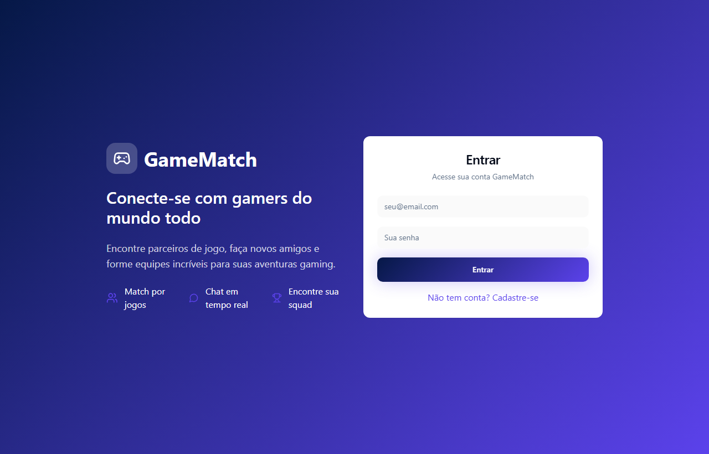
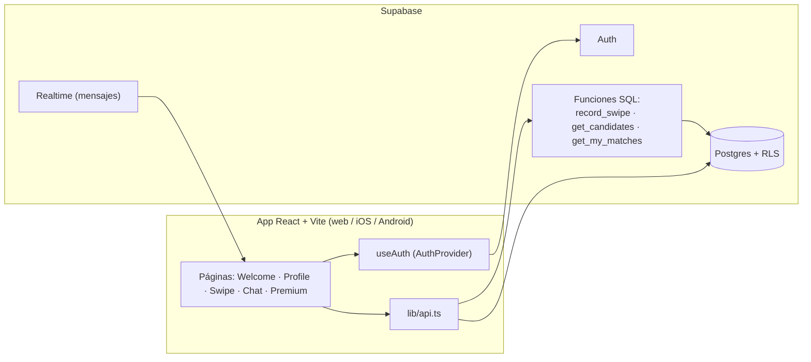

<!-- ══════════════════════════ PORTADA ══════════════════════════ -->
<div align="center">
  
</div>

<br/>

<!-- ══════════════════════ IDIOMAS / LANGUAGES ══════════════════════ -->
<div align="center">
<a href="README.md"></a>
<a href="README.en.md"></a>
<a href="README.es.md"></a>
</div>

<br/>

<!-- ══════════════════════════ PORTADA ══════════════════════════ -->
<div align="center">


<br/>


</div>

<div align="center">

<a href="#acerca-de"></a>
<a href="#funcionalidades"></a>
<a href="#arquitectura"></a>
<a href="#tecnologías"></a>
<a href="#configuración"></a>
<a href="#build-móvil"></a>

</div>

<br/>

> ⚠️ **Código cerrado.** Este repositorio es público solo para consulta/evaluación — ver [Licencia](#licencia). No se permite ningún uso, copia o distribución sin autorización.

<div align="center">
  
</div>

<!-- ══════════════════════════ ACERCA DE ══════════════════════════ -->
## Acerca de

**gamematch** es una app estilo "dating app" mobile-first para gamers. En lugar de revisar listas interminables de amigos, deslizas (swipe) entre otros jugadores, das like a quienes quieres jugar y, cuando el interés es mutuo, se forma un **match** y pueden empezar a chatear. Los perfiles se construyen alrededor de lo que la gente realmente juega — juegos favoritos, el juego actual, ubicación e intereses — para que la gente que conozcas sea gente con la que puedas armar equipo.

Es una aplicación full-stack real: frontend en React + TypeScript respaldado por **Supabase** (Postgres + Auth + Realtime), con toda la lógica de match garantizada en el servidor mediante funciones SQL y Row Level Security. El mismo build web también se empaqueta para **iOS y Android** vía Capacitor.

<!-- ══════════════════════════ FUNCIONALIDADES ══════════════════════════ -->
## Funcionalidades

| Función | Qué hace |
|---|---|
| **Autenticación por email** | Registro e inicio de sesión vía Supabase Auth; la sesión persiste y se renueva automáticamente |
| **Perfil auto-provisionado** | Se crea una fila de perfil automáticamente al registrarse (trigger en la base), con username único derivado del email |
| **Perfil editable** | Apodo, bio, edad, ubicación, avatar (emoji), juego actual, juegos favoritos e intereses |
| **Swipe / matchmaking** | Deck de tarjetas con candidatos aún no evaluados. Like, pass o super-like; un like mutuo crea un match |
| **Filtro de juego en el deck** | Filtra el deck por los juegos más comunes en el pool de candidatos |
| **Matches y chat** | Cada match abre una conversación; los mensajes se guardan por match, con el último mensaje en la lista |
| **Pantalla premium** | Página de planes/upgrade con los beneficios premium |
| **Rutas protegidas** | Perfil, swipe y chat requieren autenticación |
| **Seguro por diseño** | Row Level Security en todas las tablas — swipes, matches y acceso a mensajes se garantizan en Postgres, no solo en la UI |
| **Multiplataforma** | Funciona en el navegador y como app nativa iOS/Android vía Capacitor |

<!-- ══════════════════════════ ARQUITECTURA ══════════════════════════ -->
## Arquitectura



Cómo ocurre un match: un swipe se envía a la función `record_swipe`, que registra el like/pass y, si la otra persona ya te había dado like, crea una fila en `matches` y devuelve `{ matched: true }`. Los candidatos vienen de `get_candidates` (todos excepto tú y a quienes ya evaluaste), y `get_my_matches` devuelve cada match con el perfil de la otra persona y el último mensaje.

<!-- ══════════════════════════ TECNOLOGÍAS ══════════════════════════ -->
## Tecnologías

| Capa | Tecnología |
|---|---|
| Lenguaje | TypeScript |
| UI | React 18, Tailwind CSS + `tailwindcss-animate`, shadcn/ui (Radix UI) |
| Build | Vite 5 (`@vitejs/plugin-react-swc`) |
| Routing | React Router |
| Datos | TanStack Query |
| Formularios | React Hook Form + Zod |
| Backend | Supabase (Postgres, Auth, Realtime) |
| Móvil | Capacitor (iOS / Android) |

<!-- ══════════════════════════ CONFIGURACIÓN ══════════════════════════ -->
## Configuración

**1. Requisitos:** Node.js 18+, npm, un proyecto [Supabase](https://supabase.com/) gratuito.

**2. Instalar:**
```bash
git clone https://github.com/geoggrigori/gamematch.git
cd gamematch
npm install
```

**3. Base de datos:** en el **SQL Editor** de Supabase, ejecuta `supabase/schema.sql` — crea las tablas `profiles`, `swipes`, `matches`, `messages`, las funciones de matching, las políticas de RLS, el trigger de auto-perfil y activa Realtime en `messages`.

**4. Variables de entorno:**
```bash
cp .env.example .env.local
```
```dotenv
VITE_SUPABASE_URL=https://TU-PROYECTO.supabase.co
VITE_SUPABASE_ANON_KEY=TU-CLAVE-ANON-PUBLICA
```

**5. Ejecutar:**
```bash
npm run dev   # http://localhost:8080
```

<!-- ══════════════════════════ BUILD MÓVIL ══════════════════════════ -->
## Build Móvil

El build web se empaqueta como app nativa vía Capacitor (app id `app.gamematch.mobile`):

```bash
npm run build
npx cap add android   # una vez
npx cap add ios       # una vez, solo macOS
npx cap sync
npx cap run android
npx cap run ios       # solo macOS
```

<!-- ══════════════════════════ LICENCIA ══════════════════════════ -->
## Licencia

**Todos los derechos reservados.** Este código es público solo para visualización/evaluación (portafolio) — **no es open source**. No se otorga ningún permiso de uso, copia, modificación o distribución. Ver [`LICENSE`](LICENSE) para el texto completo.

<div align="center">
  
</div>

<p align="center"><sub>Desarrollado por <strong><a href="https://github.com/geoggrigori">Grigori</a></strong> · 2026</sub></p>
