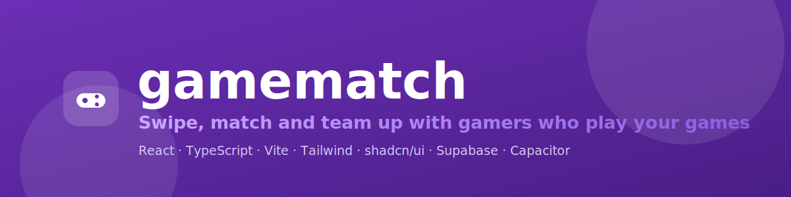
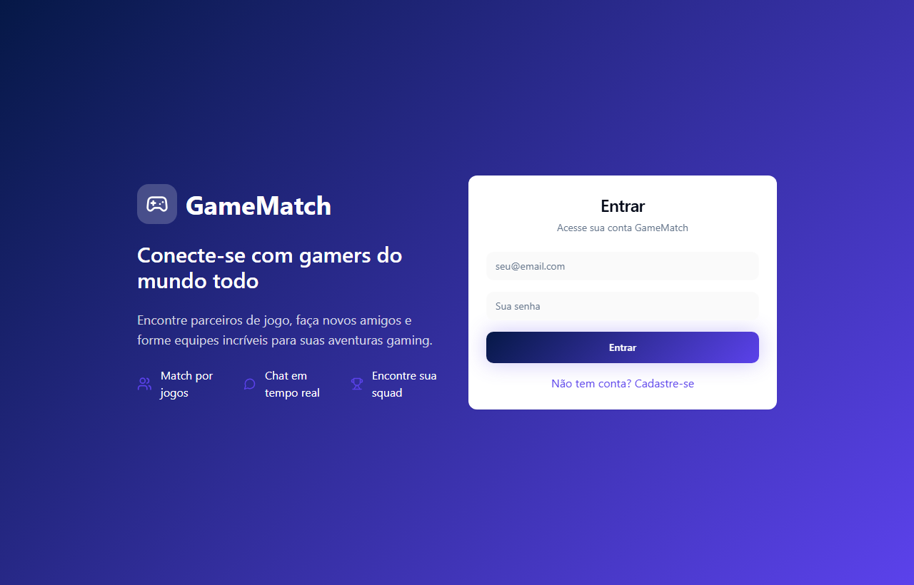
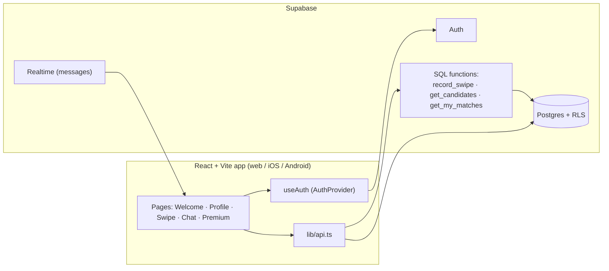

# gamematch

[](https://www.typescriptlang.org/)
[](https://react.dev/)
[](https://vitejs.dev/)
[](https://tailwindcss.com/)
[](https://supabase.com/)
[](https://capacitorjs.com/)
[](LICENSE)

**gamematch** is a mobile-first dating-style app for gamers. Instead of browsing endless friend lists, you swipe through other players, like the ones you want to play with, and when the interest is mutual you **match** and can start chatting. Profiles are built around what people actually play — favourite games, the game they're playing right now, location and interests — so the people you meet are people you can squad up with.

It's a real full-stack application: a React + TypeScript front-end backed by **Supabase** (Postgres + Auth + Realtime), with all matching logic enforced server-side through SQL functions and Row Level Security. The same web build also ships to **iOS and Android** via Capacitor.



## Features

- **Email authentication** — sign up and sign in with email/password through Supabase Auth; sessions persist and refresh automatically.
- **Auto-provisioned profiles** — a profile row is created automatically on signup (via a database trigger) with a unique username derived from the email.
- **Editable profiles** — nickname, bio, age, location, avatar emoji, current game, favourite games and interests.
- **Swipe matchmaking** — a card deck of candidate players you haven't swiped yet. Like, pass or super-like; a mutual like creates a match.
- **In-deck game filter** — filter the deck by the games most common in the candidate pool to find people playing what you play.
- **Matches & chat** — every match opens a conversation; messages are stored per match and the matches list shows the latest message.
- **Premium screen** — a subscription/upgrade page surfacing premium plans and perks.
- **Protected routes** — profile, swipe and chat are gated behind authentication.
- **Secure by design** — Row Level Security on every table; swipes, matches and message access are enforced in Postgres, not just in the UI.
- **Cross-platform** — runs in the browser and as a native iOS/Android app through Capacitor.

## Tech stack

| Layer | Technology |
| --- | --- |
| Language | TypeScript |
| UI framework | React 18 |
| Build tool | Vite 5 (`@vitejs/plugin-react-swc`) |
| Styling | Tailwind CSS + `tailwindcss-animate` |
| Components | shadcn/ui (Radix UI primitives) |
| Routing | React Router |
| Data fetching | TanStack Query |
| Icons | Lucide React |
| Forms / validation | React Hook Form + Zod |
| Notifications | Sonner |
| Backend | Supabase (Postgres, Auth, Realtime) |
| Mobile | Capacitor (iOS / Android) |

## Architecture



How a match happens: a swipe is sent to the `record_swipe` function, which records the like/pass and, if the other player already liked you back, creates a `matches` row and returns `{ matched: true }`. Candidates come from `get_candidates` (everyone except you and the people you've already swiped), and `get_my_matches` returns each match with the other person's profile and last message.

## Getting started

### Prerequisites

- Node.js 18+ and npm
- A free [Supabase](https://supabase.com/) project (for auth, database and realtime)

### 1. Install

```bash
git clone https://github.com/geoggrigori/gamematch.git
cd gamematch
npm install
```

### 2. Set up Supabase

Create a project at [supabase.com](https://supabase.com/), then open the **SQL Editor** and run the schema once:

```
supabase/schema.sql
```

This creates the `profiles`, `swipes`, `matches` and `messages` tables, the matching SQL functions, the Row Level Security policies, the auto-profile trigger, and enables Realtime on `messages`.

### 3. Configure environment variables

Copy the example file and fill in your project's values (found in **Supabase → Project Settings → API**):

```bash
cp .env.example .env.local
```

```dotenv
VITE_SUPABASE_URL=https://YOUR-PROJECT-ref.supabase.co
VITE_SUPABASE_ANON_KEY=YOUR-ANON-PUBLIC-KEY
```

### 4. Run

```bash
npm run dev      # start the dev server (http://localhost:8080)
```

| Script | Description |
| --- | --- |
| `npm run dev` | Start the Vite dev server |
| `npm run build` | Production build to `dist/` |
| `npm run build:dev` | Build in development mode |
| `npm run preview` | Preview the production build locally |
| `npm run lint` | Run ESLint |

## Mobile build (Capacitor)

The web build is wrapped as a native app via Capacitor (app id `app.gamematch.mobile`):

```bash
npm run build              # produce dist/ (Capacitor's webDir)
npx cap add android        # add Android (one time)
npx cap add ios            # add iOS (one time, macOS only)
npx cap sync               # copy the web build into the native projects
npx cap run android        # build & launch on Android
npx cap run ios            # build & launch on iOS (macOS only)
```

## Project structure

```
gamematch/
├── src/
│   ├── pages/              # Index, Welcome, Profile, Swipe, Chat, Premium, NotFound
│   ├── components/
│   │   ├── ui/             # shadcn/ui component library
│   │   └── ProtectedRoute.tsx
│   ├── hooks/
│   │   └── useAuth.tsx     # auth context (session, signUp, signIn, signOut)
│   ├── lib/
│   │   ├── supabase.ts     # Supabase client
│   │   ├── api.ts          # data access (profiles, swipes, matches, messages)
│   │   └── types.ts        # shared domain types
│   ├── App.tsx             # routes & providers
│   └── main.tsx            # entry point
├── supabase/
│   └── schema.sql          # database schema, RLS, functions, triggers
├── capacitor.config.ts     # native app configuration
├── index.html
└── vite.config.ts
```

## License

Released under the [MIT License](LICENSE).
