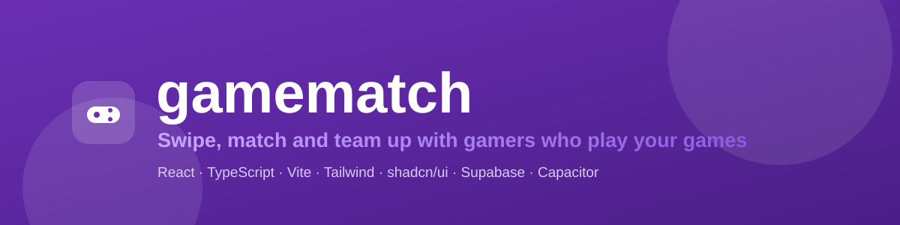
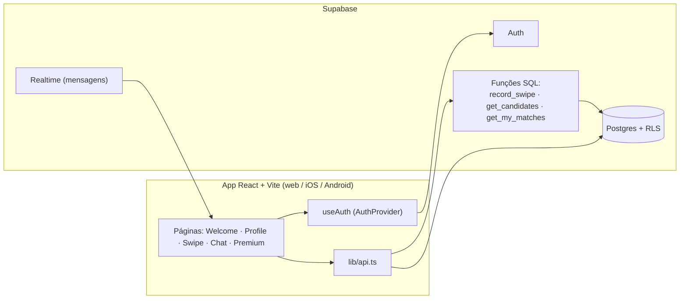

<!-- ══════════════════════ IDIOMAS / LANGUAGES ══════════════════════ -->
<div align="center">
<a href="README.md"></a>
<a href="README.en.md"></a>
<a href="README.es.md"></a>
</div>

<!-- ══════════════════════════ CAPA ══════════════════════════ -->
<div align="center">
  
</div>

<br/>

<h1 align="center">gamematch</h1>
<p align="center"><em>Um app estilo "match" para gamers: deslize, combine e jogue junto</em></p>
<p align="center"><strong>Perfil por jogo favorito → deck de swipe → match mútuo → chat em tempo real</strong></p>

<div align="center">


<br/>


</div>

<!-- ══════════════════════════ NAVEGAÇÃO ══════════════════════════ -->
<div align="center">

<a href="#sobre"></a>
<a href="#funcionalidades"></a>
<a href="#arquitetura"></a>
<a href="#tecnologias"></a>
<a href="#configuração"></a>
<a href="#build-mobile"></a>

</div>

<br/>

> ⚠️ **Código fechado.** Este repositório é público apenas para consulta/avaliação — veja a seção [Licença](#licença). Nenhum uso, cópia ou distribuição é permitido sem autorização.

<div align="center">
  
</div>

<!-- ══════════════════════════ SOBRE ══════════════════════════ -->
## Sobre

**gamematch** é um app estilo "dating app" mobile-first para gamers. Em vez de vasculhar listas infinitas de amigos, você desliza (swipe) por outros jogadores, curte quem quer jogar junto e, quando o interesse é mútuo, forma um **match** e pode começar a conversar. Os perfis são construídos em torno do que as pessoas realmente jogam — jogos favoritos, o jogo atual, localização e interesses — pra garantir que quem você encontra é gente pra formar squad.

É uma aplicação full-stack de verdade: front-end em React + TypeScript com **Supabase** (Postgres + Auth + Realtime) no back, com toda a lógica de match garantida no servidor via funções SQL e Row Level Security. O mesmo build web também vira app nativo para **iOS e Android** via Capacitor.

<!-- ══════════════════════════ FUNCIONALIDADES ══════════════════════════ -->
## Funcionalidades

| Recurso | O que faz |
|---|---|
| **Autenticação por e-mail** | Cadastro e login via Supabase Auth; sessão persiste e renova automaticamente |
| **Perfil auto-provisionado** | Uma linha de perfil é criada automaticamente no cadastro (trigger no banco), com username único derivado do e-mail |
| **Perfil editável** | Apelido, bio, idade, localização, avatar (emoji), jogo atual, jogos favoritos e interesses |
| **Swipe / matchmaking** | Deck de cards com candidatos ainda não avaliados. Curtir, passar ou super-like; curtida mútua cria um match |
| **Filtro de jogo no deck** | Filtra o deck pelos jogos mais comuns no pool de candidatos |
| **Matches & chat** | Todo match abre uma conversa; mensagens ficam salvas por match, com prévia da última mensagem na lista |
| **Tela premium** | Página de planos/upgrade com os benefícios premium |
| **Rotas protegidas** | Perfil, swipe e chat exigem autenticação |
| **Seguro por design** | Row Level Security em todas as tabelas — swipes, matches e acesso a mensagens são garantidos no Postgres, não só na UI |
| **Multiplataforma** | Roda no navegador e como app nativo iOS/Android via Capacitor |

<!-- ══════════════════════════ ARQUITETURA ══════════════════════════ -->
## Arquitetura


```mermaid
flowchart LR
  subgraph Client["App React + Vite (web / iOS / Android)"]
    UI["Páginas: Welcome · Profile · Swipe · Chat · Premium"]
    Auth["useAuth (AuthProvider)"]
    API["lib/api.ts"]
  end

  subgraph Supabase["Supabase"]
    SAuth["Auth"]
    DB[("Postgres + RLS")]
    RPC["Funções SQL:<br/>record_swipe · get_candidates · get_my_matches"]
    RT["Realtime (mensagens)"]
  end

  UI --> Auth --> SAuth
  UI --> API
  API --> RPC --> DB
  API --> DB
  RT --> UI
```

Como um match acontece: um swipe é enviado à função `record_swipe`, que registra o like/pass e, se a outra pessoa já tinha curtido antes, cria uma linha em `matches` e retorna `{ matched: true }`. Os candidatos vêm de `get_candidates` (todo mundo exceto você e quem você já avaliou), e `get_my_matches` retorna cada match com o perfil da outra pessoa e a última mensagem.

<!-- ══════════════════════════ TECNOLOGIAS ══════════════════════════ -->
## Tecnologias

| Camada | Tecnologia |
|---|---|
| Linguagem | TypeScript |
| UI | React 18, Tailwind CSS + `tailwindcss-animate`, shadcn/ui (Radix UI) |
| Build | Vite 5 (`@vitejs/plugin-react-swc`) |
| Roteamento | React Router |
| Dados | TanStack Query |
| Formulários | React Hook Form + Zod |
| Backend | Supabase (Postgres, Auth, Realtime) |
| Mobile | Capacitor (iOS / Android) |

<!-- ══════════════════════════ CONFIGURAÇÃO ══════════════════════════ -->
## Configuração

**1. Pré-requisitos:** Node.js 18+, npm, e um projeto [Supabase](https://supabase.com/) gratuito.

**2. Instalar:**
```bash
git clone https://github.com/geoggrigori/gamematch.git
cd gamematch
npm install
```

**3. Banco de dados:** no **SQL Editor** do Supabase, rode `supabase/schema.sql` — cria as tabelas `profiles`, `swipes`, `matches`, `messages`, as funções de matching, as políticas de RLS, o trigger de auto-perfil e ativa o Realtime em `messages`.

**4. Variáveis de ambiente:**
```bash
cp .env.example .env.local
```
```dotenv
VITE_SUPABASE_URL=https://SEU-PROJETO.supabase.co
VITE_SUPABASE_ANON_KEY=SUA-CHAVE-ANON-PUBLICA
```

**5. Rodar:**
```bash
npm run dev   # http://localhost:8080
```

<!-- ══════════════════════════ BUILD MOBILE ══════════════════════════ -->
## Build Mobile

O build web vira app nativo via Capacitor (app id `app.gamematch.mobile`):

```bash
npm run build
npx cap add android   # uma vez
npx cap add ios       # uma vez, só macOS
npx cap sync
npx cap run android
npx cap run ios       # só macOS
```

<!-- ══════════════════════════ LICENÇA ══════════════════════════ -->
## Licença

**Todos os direitos reservados.** Este código é público apenas para visualização/avaliação (portfólio) — **não é open source**. Nenhuma permissão de uso, cópia, modificação ou distribuição é concedida. Veja [`LICENSE`](LICENSE) para o texto completo.

<div align="center">
  
</div>

<p align="center"><sub>Desenvolvido por <strong><a href="https://github.com/geoggrigori">Grigori</a></strong> · 2026</sub></p>
